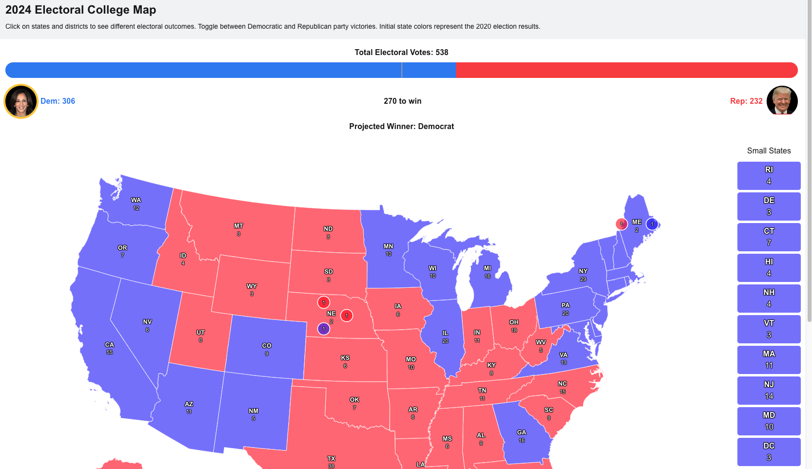

# Map the Vote

Map the Vote is an interactive map of the 2024 U.S. Electoral College map where you can explore different electoral scenarios across the country. 

## Project Overview

This project is designed to demonstrate simple geospatial data representation and user interaction in a React web application.



This interactive map allows users to:
- Visualize the current Electoral College distribution
- Click on states to toggle between Democratic and Republican victories
- See real-time updates of electoral vote counts as they are clicked
- Export the customized map as an image

## Technologies Used

- [Next.js](https://nextjs.org/) - React framework for building the web application
- [Visx Geo](https://airbnb.io/visx/docs/geo) - Low-level map visualization
- [Tailwind CSS](https://tailwindcss.com/) - For styling and responsive design
- [html2canvas](https://html2canvas.hertzen.com/) - For exporting the map as an image

## Features

- Interactive U.S. map with state-level detail
- Real-time electoral vote counting
- Responsive design for various screen sizes
- Export functionality to save custom electoral scenarios
- Detailed handling of special cases like Maine and Nebraska's district-level electoral votes

## Getting Started

To run this project locally:

1. Clone the repository
2. Install dependencies:
   ```bash
   npm install
   ```
3. Run the development server:
   ```bash
   npm run dev
   ```
4. Open [http://localhost:3000](http://localhost:3000) in your browser

## Data Sources
The electoral vote data and state information are stored in JSON files in the `public/data` directory. 

## Contributing
Please feel free to submit issues or pull requests.

## License
This project is open-source and available under the MIT License.
